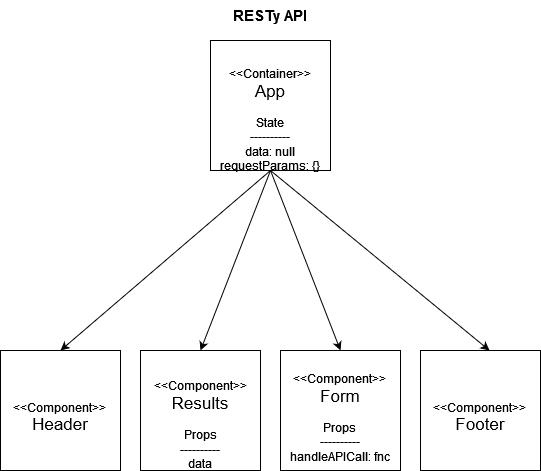

# RESTy-API

This application is an API testing tool that can be run in any browser, allowing a user to easily interact with APIs in a familiar interface.

## Requirements

__Phase 1: Application Setup__

* React Application with the proper scaffolding will be complete
* App scaffolding will have basic state defined and have main components properly rendered

------------

### CodeSandbox URL

  _Live application code found [here](https://codesandbox.io/s/ecstatic-lewin-8fn0x)_

### Diagram

(Phase 1)

